# University-Management-System-ETL-Pipeline

This project is a **complete end-to-end ETL (Extract, Transform, Load) pipeline** designed to populate a realistic **University Management System database**. It uses Python to generate synthetic but structured data for students, staff, courses, modules, enrollments, marks, transport, and residential allocations.

The system was built to:

* Simulate real-world university data.
* Practice and demonstrate ETL concepts.
* Prepare for data engineering, backend development, and full‑stack expansion.

---

##  Features

###  **1. Lookup & Structural Data Auto‑Generation**

The pipeline automatically inserts essential academic structure data such as:

* Levels
* Qualifications
* Departments
* Courses
* Modules

###  **2. Staff Data & Lecturer Assignments**

Randomized staff generation including:

* Lecturers
* Technicians
* Admin
* Security
* Drivers

The script then assigns lecturers to modules.

###  **3. Student Data (5,000 records)**

Generated student fields:

* Student number
* First & last name
* Gender
* Birthdate
* Contact
* Program level, course, department

###  **4. Enrollments & Marks (20,000 each)**

The pipeline assigns each student to multiple modules and generates marks.

###  **5. Residential Data (5,000 records)**

Students are assigned to:

* Residence names
* Room numbers

###  **6. Shuttle System**

Data added for:

* Shuttle pick‑up points
* Bus info
* Bus allocations

###  **7. Applicants Table**

Simulated applicants with:

* Application status
* Intended program
* Demographic data

---

##  Tech Stack

### **Python**

Used for generating and loading data.

### **MySQL**

Database for structured storage.

### **Libraries**

* `mysql.connector`
* `random`
* `datetime`

---

##  Project Structure

```
University Management System ETL-Pipeline/
│── MainSystem.py                # Main ETL script
│── Create_FullDB.sql            # Any external datasets
│── README.md                    # Project documentation
```

---

##  Example Output Summary

Upon successful execution, you will see logs such as:

```
Connected to university_system
Base lookup data inserted.
Levels inserted.
Qualifications inserted.
Departments & 36 Courses inserted successfully.
168 modules inserted.
Staff, courses, and modules inserted safely.
5000 Students inserted.
20000 student enrollments inserted.
20000 marks inserted.
Inserting student enrollments...
5000 student enrollments inserted.
Shuttle points & buses inserted.
Bus allocations inserted.
Applicants inserted.
Lecturers: 2
Modules: 168
2 lecturer-module assignments inserted.
Inserting student residential data...
5000 student residential records inserted.

All data generation completed successfully
```

---

##  Future Plans (Full‑Stack Expansion)

This project is being expanded into a **full university management platform**. Planned additions:

###  **Backend (Python / FastAPI / Flask)**

* REST API for retrieving and updating university data
* Authentication (JWT)
* Role-based access (Admin, Lecturer, Student)

###  **Frontend (React / Next.js)**

* Student portal (timetable, modules, results)
* Admin dashboard (course & staff management)
* Lecturer portal (upload marks, attendance)

###  **Data Engineering Enhancements**

* Airflow DAG for automated ETL scheduling
* Data quality checks
* Warehouse layer (Star schema)

###  **AI Integration (Future)**

* AI assistant for students
* Predictive analytics on student performance

---

##  Purpose

This project serves as:

* A portfolio‑ready data engineering project
* A base for backend/full‑stack development
* A learning environment for ETL automation

---

##  Installation & Usage
### **Installation**
```
1. Clone the repository

```
git clone https://github.com/JoTM-stack/University-Management-System-ETL-Pipeline.git
```
2. Run the Server
```
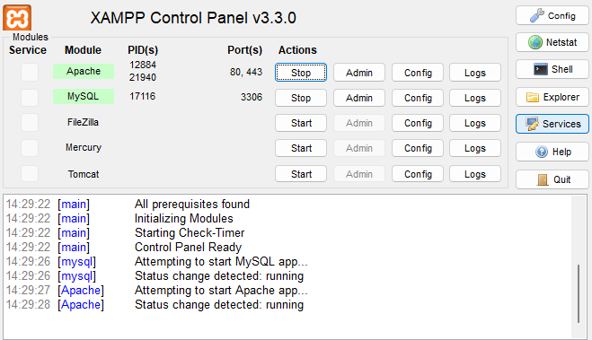 
```

3. Open MySql Workbench

```
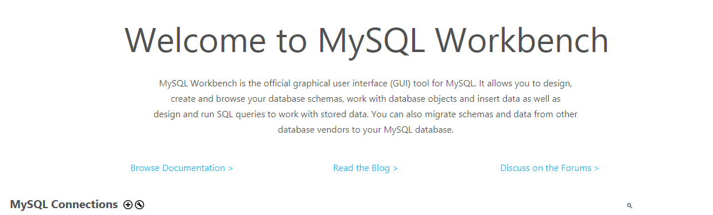
```
4. Set up a connection

```
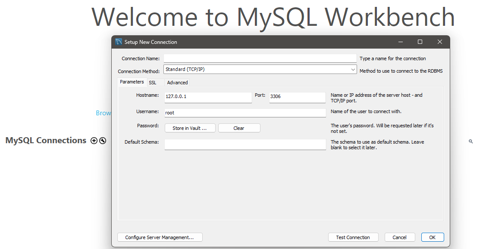
```
5. Test connection

```
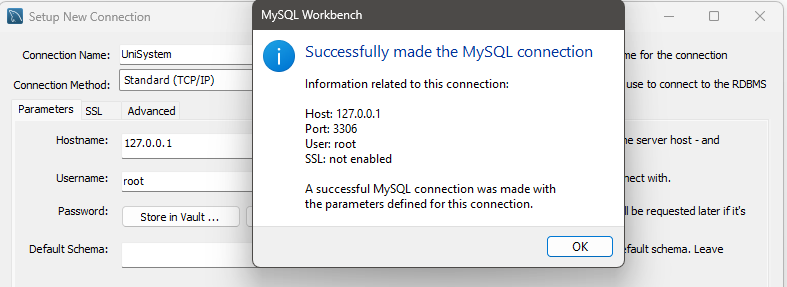
```
6. Open connection

```
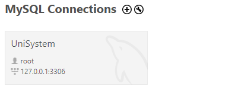
```
7. Load SQL Script

```
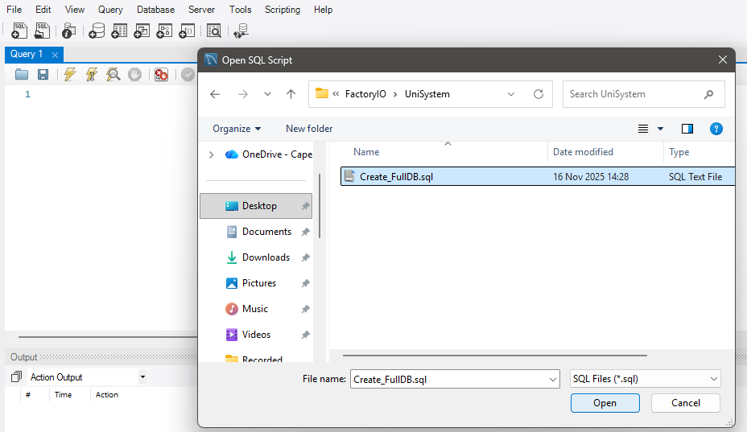
```
8. Loaded SQL Script

```
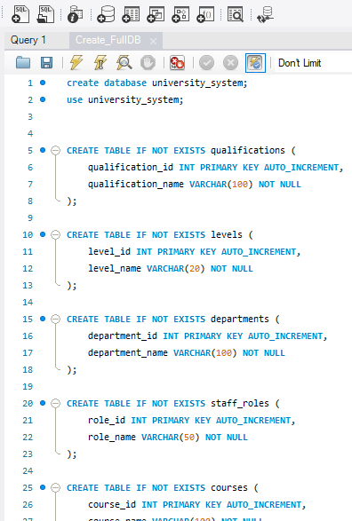
```

8. Run SQL Script

```
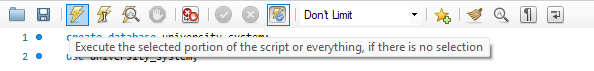
```

9. Execution Logs

```
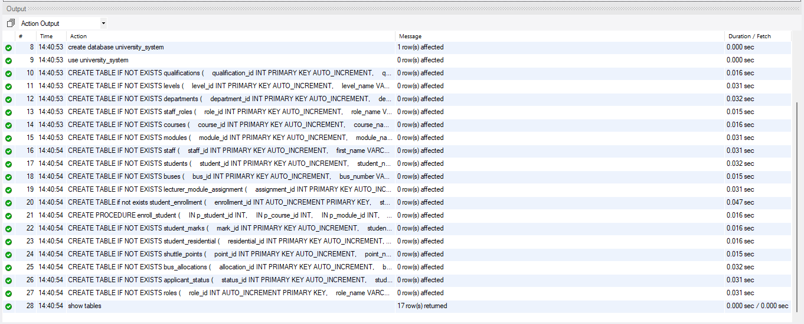
```
10. Output

```
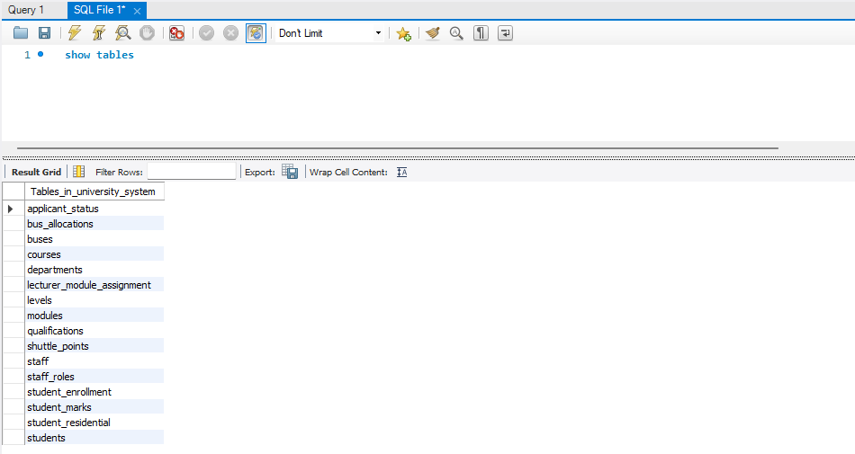
```

12. Run the Pipeline

```
python MainSystem.py
```

12. Pipeline Output

```
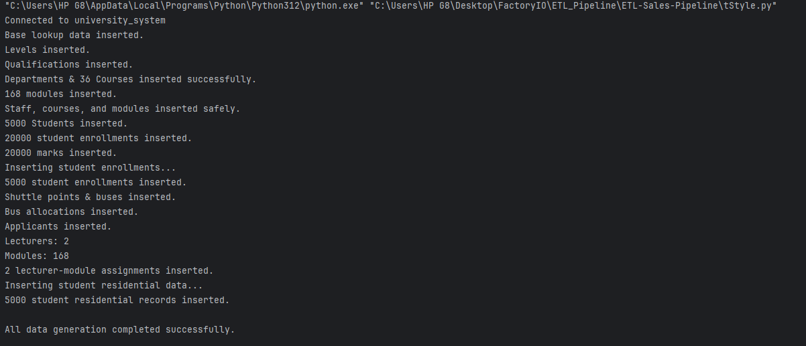
```

---

##  Conclusion

This project started as a data‑generation ETL system but is evolving into a full **University Information System** with backend, frontend, and AI features.

It demonstrates strong skills in:

* Database design
* ETL automation
* Python scripting
* Data modeling
* System architecture

And is designed to grow into a production‑ready system.

---
